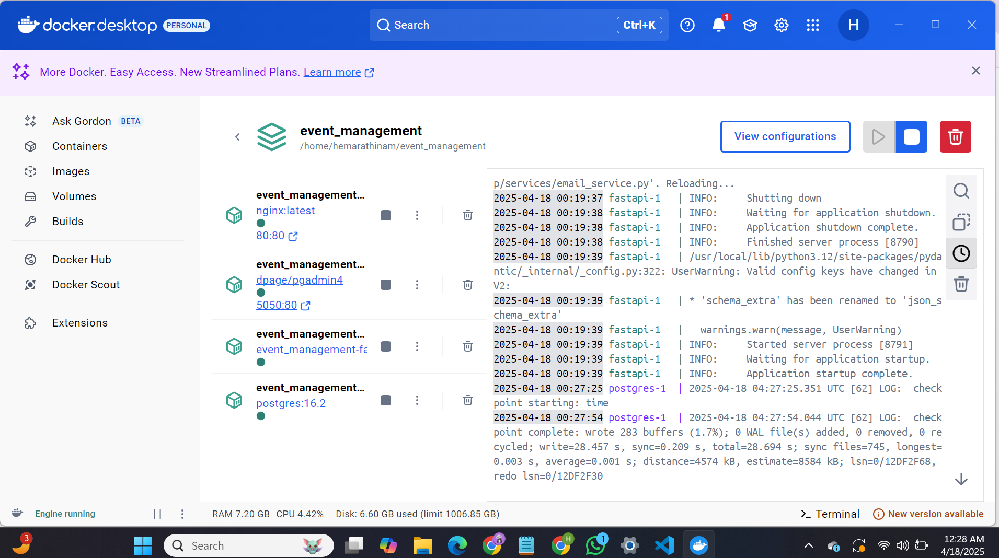

Event Manager Company using RESTAPI!!!

Welcome to the Event Manager Company! As a newly hired Software QA Analyst/Developer and a student in software engineering, you are embarking on an exciting journey to contribute to our project aimed at developing a secure, robust REST API that supports JWT token-based OAuth2 authentication. This API serves as the backbone of our user management system and will eventually expand to include features for event management and registration.

SETUP INSTRUCTIONS :
STEP 1: Fork the Professor's Repository to our own github account.

STEP 2: To access the Forked Repository locally, clone the Forked Repository.

 git clone https://github.com/Hemavathi-2107/event_management.git

STEP 3: Start the application using Docker
 docker compose up --build

STEP 4: Access Swagger UI at : localhost/docs

STEP 5: Access PGAdmin at : localhost:5050

ISSUES RESOLVED:

1. Verification Token Not Being Sent in Email
The Verification Token is not being sent in the email. Only the verification URL is being sent. Need to send Verification Token Along with Verification Link

Issue Link: https://github.com/Hemavathi-2107/event_management/issues/13

2. Login Page Fix
The Login is Asking for Username and Password Even though we use email-id for login .

Issue Link: https://github.com/Hemavathi-2107/event_management/issues/11

3. Password Strength Setting
The Password Strength Setting issue arises when the system allows users to create weak passwords that are easy to guess or brute-force. This compromises account security. Implementing strong password policies—such as minimum length, inclusion of uppercase, lowercase, numbers, and special characters—is essential to protect user accounts from unauthorized access.

Issue Link: https://github.com/Hemavathi-2107/event_management/issues/9

4. Email Validation
The email validation issue occurs when the system accepts improperly formatted email addresses or rejects valid ones. This can lead to failed registrations, undelivered emails, or security risks. Proper validation should enforce standard email formats using regular expressions and ensure domain-level checks to maintain user data integrity and communication reliability.

Issue Link: https://github.com/Hemavathi-2107/event_management/issues/5

image

5. Mismatched Data in Login and Register
The issue arises due to inconsistency in the test data used for user registration and login. The user is registered with one password but attempts to log in using a different one, resulting in authentication failure. Ensuring the same credentials are used across both processes will resolve the mismatch.

Issue Link : https://github.com/Hemavathi-2107/event_management/issues/3

All fixes were tested and merged into the main branch using GitHub’s pull request workflow.

DOCKER DEPLOYMENT:

TESTING:

REFLECTIONS:

I was able to relate theory to practical API development thanks to this project.  I gained a lot of knowledge about Pydantic validation, async database handling, and FastAPI.  I gained practical expertise with safe, maintainable deployments by troubleshooting user issues and configuring CI/CD using Docker and GitHub Actions.  These abilities will be helpful for upcoming industrial jobs and group assignments.

